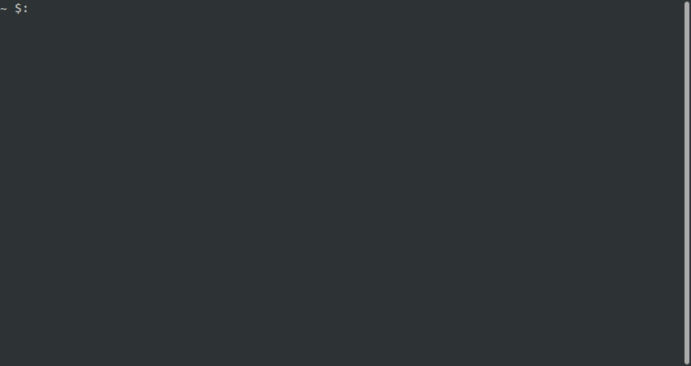

## minishell

team project of École 42 where it is necessary to implement own version of shell from scratch in C.

the program can parse a prompt and run executables with arguments. implemented several built-in functions, environment variables, pipes and redirects.

the project was made in accordance with the school design code standard in C language.



### how to use
```
make
./shell
```

### features
- implementation of redirections `>`, `>>`, `<` and pipes `|`
- `'`, `"` and separate commands with `;` work the same as in bash
- signal management. `ctrl + c`, `ctrl + \` and `ctrl + d` work like in bash
- implementation of some builtins: `echo`, `cd`, `exit`, `pwd`, `export`, `unset`, `env`
- navigation through command history using up `↑` and down `↓` arrows. implemented with termcaps
- environment variables are handled, like `$HOME`, including the return code `$?` after command execution

### development team
[daniseed](https://github.com/MalinPolina) and [constbar](https://github.com/constbar)
